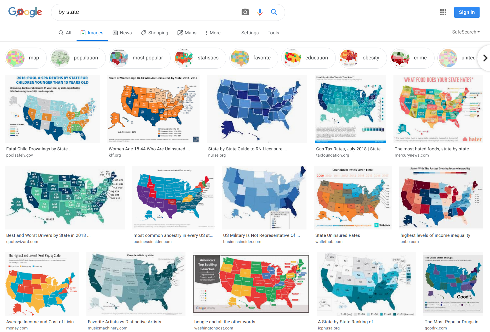

# Guide to Showing State-by-State Data on a Map



The above screenshot shows the result of Googling "by state." As a data analyst, you too have probably dealt with data organized by state at some point. Visualizing such data on a map can help you spot regional trends and anomalies. It's also a more attractive way to present your analysis, as a bar chart with 50 bars is just not very pretty.

You may also know that creating such thematic map (technically known as a [choropleth](https://en.wikipedia.org/wiki/Choropleth_map)) is non-trivial. You either have to reach for specialized geospatial tools or dive deep into Javascript/D3 programming. Here I'll show you a much simpler alternative using [Vega-Lite](https://vega.github.io/vega-lite/), a visualization language where you specify your graph using JSON. At the end of this tutorial, you'll have created this population growth choropleth.

```{vl file=pop_growth_rate.vl.json}
```
*Note: Source code and data for this article, including all visualizations, are in this [Github repo](https://github.com/capta-journal/map). You are welcome to fork the repo, edit it, and republish your version within [capta.studio](https://www.capta.studio/publish).*

## Building the Choropleth
We'll show how we build the choropleth above in four steps. After the first two steps you'll have a recognizable choropleth. The third step tidy things up to make it more presentable. The last step shows a few advanced techniques to make the visualization more meaningful.

### Step 1: Show a Map
```{vl}
{
  "$schema": "https://vega.github.io/schema/vega-lite/v3.json",
  "data": {
    "url": "topojson/cb_2018_us_state_5m.json",
    "format": { "type": "topojson", "feature": "states" }
  },
  "projection": { "type": "albersUsa" },
  "mark": { "type": "geoshape", "fill": "lightgray", "stroke": "gray" }
}
```

The foundation of a choropleth is a map, and this is often where most people get stuck. There are two challenges. First is whether your visualization tool even supports rendering of maps. Fortunately [Vega-Lite](https://vega.github.io/vega-lite/) provides great support for geospatial visualization. In fact, the United States map above is rendered by just a few lines:

```json
{
  "$schema": "https://vega.github.io/schema/vega-lite/v3.json",
  "data": {
    "url": "topojson/cb_2018_us_state_5m.json",
    "format": { "type": "topojson", "feature": "states" }
  },
  "projection": { "type": "albersUsa" },
  "mark": { "type": "geoshape", "fill": "lightgray", "stroke": "gray" }
}
```

While the first challenge is technical, the second challenge is about data: specifying the geometrical shapes to render a map. This challenge is solved in the Vega-Lite spec above by the file `cb_2018_us_state_5m.json`. This file, in TopoJSON format, contains data (in lat/lon) on the shape and location of all 50 states. We created it based on digital data from the Census Bureau. The code and the gory details to generate this file is documented elsewhere. But unless you're looking to single-handedly revise state boundaries, feel free to reuse our file. In addition, we have a catalog of other pre-made maps for you to build other choropleths (countries of the world, counties in US, etc.) And if you don’t see one that fits your need, you can create an issue on Github to ask the community for help. Chances are some other people will have the same need and will be happy to help create it.


### Step 2: Add Color / Data
For our example we'll use [population estimates from the U.S. Census Bureau](https://www.census.gov/data/tables/time-series/demo/popest/2010s-state-total.html). We've downloaded the data as a [CSV file](data/PEP_2018_PEPTCOMP.csv) and included it in [this document's repo](https://github.com/capta-journal/map) for archive.

https://www.census.gov/data/tables/time-series/demo/popest/2010s-state-total.html

Note the use of `\\.` in specifying `key`.


```{vl}
{
  "$schema": "https://vega.github.io/schema/vega-lite/v3.json",
  "data": {
    "url": "topojson/cb_2018_us_state_5m.json",
    "format": { "type": "topojson", "feature": "states" }
  },
  "projection": { "type": "albersUsa" },
  "mark": { "type": "geoshape", "fill": "lightgray", "stroke": "gray" },
  "transform": [{
    "lookup": "id",
    "from": {
      "data": { "url": "data/PEP_2018_PEPTCOMP.csv" },
      "key": "GEO\\.id2",
      "fields": ["popchg4201072018"]
    }
  }],
  "encoding": {
    "color": {
      "field": "popchg4201072018",
      "type": "quantitative"
    }
  }
}
```

### Step 3: Customize Legend and Tooltip
The population information is now encoded on the map. Let's go ahead and fix a few visual loose ends.

The default legend is quite poor in this case. It assumes the title from our data's field name ("popchg4201072018"), which will just be cryptic to our readers. The labels on the legend ("1,000,000", "2,000,000", and "3,000,000") are so long that they're squished together. Let's customize the title and reformat the labels.

If you mouse over the states (or tap on a mobile device), you'll see a tooltip showing details of the underlying data. The default tooltip in this case has the similar problems as the legend: the title is again the cryptic "popchg4201072018" and the labels can be better formatted. Here the labels don't need to be shortened, but we want to add commas or periods to make them more readable. In addition, we want to help the reader identify states by showing their names in the tooltip. Fortunately, the ready-to-use topojson file includes not only the data to render a map, but it also has other useful information in its `properties` object. State name is encoded in `properties.NAME` and we'll show that in our tooltip.

The added code is shown below. Of note is the `titleLimit` for legend. It's the limit (in pixels) of how long the title can be. [The default is 180](https://vega.github.io/vega-lite/docs/legend.html#title) which is too short for our title. As mentioned above, we change how the numbers are formatted using the `format` property. Explanation for the code is given in the [(Vega-Lite/D3) documentation](https://github.com/d3/d3-format#locale_format).

```{vl}
{
  "$schema": "https://vega.github.io/schema/vega-lite/v3.json",
  "data": {
    "url": "topojson/cb_2018_us_state_5m.json",
    "format": { "type": "topojson", "feature": "states" }
  },
  "projection": { "type": "albersUsa" },
  "mark": { "type": "geoshape", "fill": "lightgray", "stroke": "gray" },
  "transform": [{
    "lookup": "id",
    "from": {
      "data": { "url": "data/PEP_2018_PEPTCOMP.csv" },
      "key": "GEO\\.id2",
      "fields": ["popchg4201072018"]
    }
  }],
  "encoding": {
    "color": {
      "field": "popchg4201072018",
      "type": "quantitative",
      "legend": {
        "title": "Total Population Change (2010-2018)",
        "titleLimit": 300,
        "format": "~s"
      }
    },
    "tooltip": [
      {
        "field": "properties.NAME",
        "type": "nominal",
        "axis": { "title": "State" }
      },{
        "field": "popchg4201072018",
        "type": "quantitative",
        "format": ",",
        "axis": { "title": "Population Change" }
      }
    ]
  }
}
```


### Step 4: Bonus - Calculate Other Values
The previous three steps are sufficient for making a usable choropleth. For making your own choropleth, that may be all the code you'll need. However, this minimal attempt may not always bring out the necessary insights from data, which can be context-specific. For our population change visualization, an analyst may want to bring out different points:
1. The color scale is linear, while population change is not. The 3.5M additional residents in Texas is more than the total population of some states. It's overwhelming and (misleadingly) makes the rest of the country look stable.
2. Depending on the context, the relative population change may be more important than the absolute population change. For example, if I'm a business looking for additional customers, I may care only about the absolute number. On the other hand, if I'm a sociologist investigating population trends, the relative number would be more useful.
3. The color scale can be locked onto special reference values. For example, population change can, and does, have negative values. It could be useful to have a color scale that locks onto zero and differentiates between positive and negative growth. As an alternative, one may "zero-indexed" on the *national growth rate* instead, so the differentiation is between those growing faster than average and those that are slower. This would be helpful in understand where the population gravity is shifting.

For this exercise I'll change the choropleth to show percentage population growth and the color scale indexed around the national growth rate. For your own choropleth you may have a different set of customizations (or none at all). I've chosen this set of changes mostly because it's a realistic requirement while also illustrates a few techniques.


```{vl}
{
  "$schema": "https://vega.github.io/schema/vega-lite/v3.json",
  "data": {
    "url": "topojson/cb_2018_us_state_5m.json",
    "format": { "type": "topojson", "feature": "states" }
  },
  "projection": { "type": "albersUsa" },
  "mark": { "type": "geoshape", "fill": "lightgray", "stroke": "gray" },
  "transform": [{
    "lookup": "id",
    "from": {
      "data": { "url": "data/PEP_2018_PEPTCOMP.csv" },
      "key": "GEO\\.id2",
      "fields": ["popchg4201072018"]
    }
  },{
    "lookup": "id",
    "from": {
      "data": { "url": "data/PEP_2018_PEPANNRES.csv" },
      "key": "GEO\\.id2",
      "fields": ["rescen42010"]
    }
  },{
    "calculate": "datum.popchg4201072018 / datum.rescen42010",
    "as": "growth"
  }],
  "encoding": {
    "color": {
      "field": "growth",
      "type": "quantitative",
      "scale": {
        "scheme": "purplegreen"
      },
      "legend": {
        "title": "Population Growth Rate (2010-2018)",
        "titleLimit": 300,
        "format": ".1%"
      }
    },
    "tooltip": [
      {
        "field": "properties.NAME",
        "type": "nominal",
        "axis": { "title": "State" }
      },{
        "field": "popchg4201072018",
        "type": "quantitative",
        "format": ",",
        "axis": { "title": "Total Population Change" }
      },{
        "field": "growth",
        "type": "quantitative",
        "format": ".1%",
        "axis": { "title": "Growth Rate" }
      }
    ]
  }
}
```

In addition to converting our choropleth to show growth rate, we also changed the color scheme to a "divergent" one, meaning the color intensity goes up on both ends of the scale. For our data, the default center of the scale has no particular meaning, so we should change it to something more interpretable. An obvious choice is to center at zero. To do so, we could specify a scale from -15% to +15%, which would cover all possible values while ensuring the middle is at zero. (We chose 15% because from the graph above we know Utah is the fastest growing state at 14.4%.)

We'll leave it to you to make that change. Here we'll do something a little fancier. From looking at the original data, we know the total U.S. population increase was 18,409,329, based on a 2010 population of 308,745,538. That is, the U.S. population has grown 6%. Let's use a color range to help see states that are growing faster than this national average versus the slower growing states. With a little bit of arithmetic, we decide to use a scale from -3% to 15%, to ensure centering at 6%.

```{vl file=pop_growth_rate.vl.json}
```

