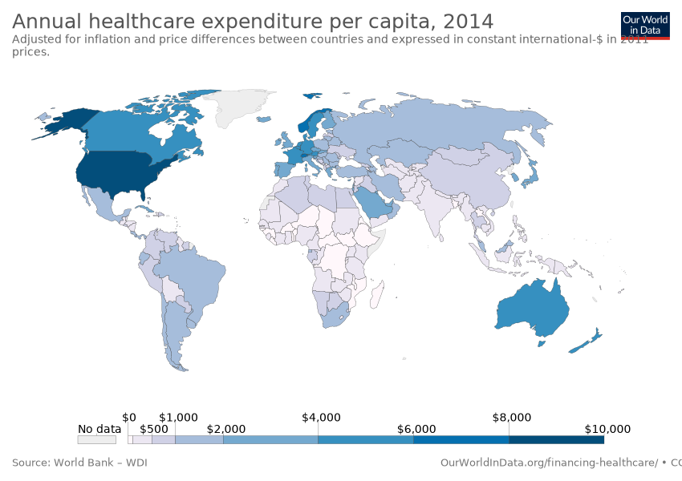

# Data Visualization using Maps: Creating a Choropleth of the World

While you may not have heard of the word *choropleth*, chances are you've seen it in the news and elsewhere. A [choropleth](https://en.wikipedia.org/wiki/Choropleth_map) is a map in which areas are shaded to illustrate some data. For example, here is [Our World in Data](https://ourworldindata.org/) showing [annual healthcare expenditure per capita for various countries](https://ourworldindata.org/grapher/annual-healthcare-expenditure-per-capita).



Given how familiar choropleths are, it should be in every data journalist's toolbox. Unfortunately most methods to create choropleths either don't allow much customization, or they start with the assumption that you are already an expert in something like D3.js or R. Here we want to leverage vega-lite and our ready-to-use starter maps and templates to make common choropleths easy without sacrificing power. I'll walk through reproducing the data viz above and also add a couple improvements. At the end you'll have made this:
```{vl file=annual-healthcare-expenditure-per-capita.vl.json}
```

## Preliminary
There are three things you need to create a choropleth. One is obviously some **data** you want to visualize over a map. As a data analyst this is where your expertise comes in. For our example we'll be based on [Our World in Data](https://ourworldindata.org/grapher/annual-healthcare-expenditure-per-capita). The original dataset includes healthcare expenditure data for various years. We filtered it down to only 2014 statistics. Here's a look at our CSV file:

```{csv file=data/annual-healthcare-expenditure-per-capita-2014.csv}
```

After providing your **data**, you'll need a **map** as the basis of your choropleth and some **code** to tie your data and the map together. There's an entire profession of cartographers dedicated to making maps. However, we believe there's an 80/20 rule here. A small number of pre-made maps can cover a substantial portion of choropleths that a data analyst will likely need. For our current example we'll use [a ready-to-use map of the world showing country boundaries](topojson/ne_110m_admin_0_countries.json). We have a catalog of other pre-made maps to show smaller regions or different boundaries. And if you don't see one that fits your needs, you can create an issue on Github to ask the community for help. Chances are some other people will have the same needs and will be happy to collaborate to add to this repo of useful maps.

(All our maps are represented in a format called [TopoJSON](https://github.com/topojson/topojson). From here on references to "topojson file" simply means a specific format of map file.)

## Building the Choropleth
Now that we have a data file (in CSV format) and the appropriate map file (in TopoJSON format). The rest of this article will cover how to write a vega-lite file to tie those two together to create a choropleth. Vega-lite files are written in the JSON format and it reads more like a set of specifications than programming code. The impatient can jump to the bottom and start copying-and-pasting the final code. Or follow along to see how we iteratively add to our vega-lite specification to get to the final product.

### Step 1: Show a Map
First, we start with a boilerplate that just shows a map from our topojson file, without any data yet. Like this:
```{vl}
{
  "$schema": "https://vega.github.io/schema/vega-lite/v3.json",
  "data": {
    "url": "topojson/ne_110m_admin_0_countries.json",
    "format": {
      "type": "topojson",
      "feature": "countries"
    }
  },
  "mark": {
    "type": "geoshape",
    "fill": "lightgray",
    "stroke": "gray"
  },
  "projection": {
    "type": "naturalEarth1"
  }
}
```
The above is generated from this vega-lite spec.
```json
{
  "$schema": "https://vega.github.io/schema/vega-lite/v3.json",
  "data": {
    "url": "topojson/ne_110m_admin_0_countries.json",
    "format": {
      "type": "topojson",
      "feature": "countries"
    }
  },
  "mark": {
    "type": "geoshape",
    "fill": "lightgray",
    "stroke": "gray"
  },
  "projection": {
    "type": "naturalEarth1"
  }
}
```

As I said earlier, vega-lite works with a specification rather than programming code. The specification is a JSON object that identifies itself by its own `$schema` property. The spec above uses the `data` property to point to our ready-to-use map file. Vega-lite needs to know that this file is in topojson `format.type` and we're using its `countries` feature.

The `mark` property tells vega-lite what type of visual 'mark' to display our `data`. For a choropleth this will always be `geoshape`. Here we also specify colors for drawing the map. Feel free to leave them out or try different colors.

The `projection` property is uniquely used by map visualizations. It specifies a method to project points and shapes from a spherical globe onto a 2-D surface like your screen. Different projections make different trade-offs between accurate depictions of area, angle, etc. You may have heard of the Mercator projection; it's a very popular way of drawing maps and it's what Google Maps use. However, Mercator tends to exaggerate areas near North and South Poles. For a world choropleth I prefer the `naturalEarth1` projection used here (as well as by the original Our World in Data map), which distorts the northern and southern areas less but doesn't maintain the angles as well. [Here's a tool to see various common projections](https://vega.github.io/vega/docs/projections/) that are supported by vega-lite. Feel free to switch this from `naturalEarth1` to `mercator` or other projections.

### Step 2: Add Color
So we've created a map, but to make it a choropleth we need to bring in our healthcare expenditure data and modulate each country's color based on it. To do so we will add a couple properties to the vega-lite spec.
```json
{
  "$schema": ...,
  "data": ...,
  "mark": ...,
  "projection": ...,
  "transform": [{
    "lookup": "properties.ISO_A3",
    "from": {
      "data": { "url": "data/annual-healthcare-expenditure-per-capita-2014.csv" },
      "key": "Code",
      "fields": [" (constant 2011 international $)"]
    }
  }],
  "encoding": {
    "color": {
      "field": " (constant 2011 international $)",
      "type": "quantitative"
    }
  }
}
```

The first thing we added is a `transform` property, which specifies an array of steps to process the data. Here we have only one step performing a 'lookup' transform. In our case this transform *looks up* for each country a value from our healthcare expenditure data. The `from` property specifies what vega-lite needs to know about our lookup data. Recall from our data (or looking at the first line of the CSV file), we have four columns:
```
Entity,Code,Year, (constant 2011 international $)
...
```
We clearly want ` (constant 2011 international $)` to be the data field to showcase, so it's specified within `from.fields` of the lookup transform. The `from.data.url` should be self-explanatory. The `from.key` field specifies which column is the lookup key in our dataset. The proper choice depends on what's in our dataset as well as what's in the topojson file. Our pre-made topojson files have many of the standard geographic identifiers embedded in their `properties` field. For example, the world map file has [ISO 3166-1](https://en.wikipedia.org/wiki/ISO_3166-1#Current_codes) codes embedded. ISO 3166-1 is really a whole set of codes for identifying countries. The Alpha-3 code consists of three uppercase letters ("USA"). The Alpha-2 code consists of two uppercase letters ("US"). And the Numeric code is a three-digit number (840 for US). These are coded in our topojson as ISO_A3, ISO_A2, and ISO_N3, respectively. The `Code` column in our dataset seems to be using the ISO_A3 convention, so that's the column we'll use and specify `properties.ISO_A3` as our `lookup`.^[The topojson file also has the `NAME` property, so in principle that could be used with the CSV's `Entity` column if `Code` wasn't available. However, `NAME` is English-centric and less well-defined. So we try to avoid it and use standardized code whenever possible.]

The `transform` property is the key to making a choropleth. The `encoding` property now simply maps the field we've "looked up" (` (constant 2011 international $)`) into colors on the choropleth. That field has continuous value so it's of the type `quantitative` (instead of say, ordinal or nominal). With those two additional properties we now have a real choropleth!

```{vl}
{
  "$schema": "https://vega.github.io/schema/vega-lite/v3.json",
  "data": {
    "url": "topojson/ne_110m_admin_0_countries.json",
    "format": { "type": "topojson", "feature": "countries" }
  },
  "mark": { "type": "geoshape", "fill": "lightgray", "stroke": "gray" },
  "projection": { "type": "naturalEarth1" },
  "transform": [{
    "lookup": "properties.ISO_A3",
    "from": {
      "data": { "url": "data/annual-healthcare-expenditure-per-capita-2014.csv" },
      "key": "Code",
      "fields": [" (constant 2011 international $)"]
    }
  }],
  "encoding": {
    "color": {
      "field": " (constant 2011 international $)",
      "type": "quantitative"
    }
  }
}
```

### Step 3: Fix Missing Data
But something seems to be missing... Oh, Antartica, Greenland, Somalia, and North Korea are not on the map anymore. Turns out we don't have any healthcare statistics for those regions. Argh.... missing data doesn't spark joy... But we probably shouldn't KonMari those regions away. To get them back, we first set the vega-lite configuration `invalidValues` to `null`, which tells it to set missing values to null. (The default was to drop the entire data point.) And when determining their color, we'll find all these `null` values and give them a special color (light gray).
```json
{
  "$schema": ...,
  "data": ...,
  "mark": ...,
  "projection": ...,
  "transform": ...,
  "encoding": {
    "color": {
      "field": ...,
      "type": ...,
      "legend": { "title": "Healthcare spend ($)" },
      "condition": {
        "test": "datum[' (constant 2011 international $)'] === null",
        "value": "lightgray"
      }
    }
  },
  "config": {
    "invalidValues": null
  }
}
```
Now all those regions are back! we also snuck in a change to the legend title to make it shorter. The fact that the healthcare spending is measured in constant 2011 international dollar is better given in the surrounding context. At this point, other than the color scheme being a little more yellowish, we have recreated the same choropleth as the original!
```{vl}
{
  "$schema": "https://vega.github.io/schema/vega-lite/v3.json",
  "data": {
    "url": "topojson/ne_110m_admin_0_countries.json",
    "format": { "type": "topojson", "feature": "countries" }
  },
  "mark": { "type": "geoshape", "fill": "lightgray", "stroke": "gray" },
  "projection": { "type": "naturalEarth1" },
  "transform": [{
    "lookup": "properties.ISO_A3",
    "from": {
      "data": { "url": "data/annual-healthcare-expenditure-per-capita-2014.csv" },
      "key": "Code",
      "fields": [" (constant 2011 international $)"]
    }
  }],
  "encoding": {
    "color": {
      "field": " (constant 2011 international $)",
      "type": "quantitative",
      "legend": { "title": "Healthcare spend ($)" },
      "condition": {
        "test": "datum[' (constant 2011 international $)'] === null",
        "value": "lightgray"
      }
    }
  },
  "config": {
    "invalidValues": null
  }
}
```

### Step 4: Add Customization
The benefit of open source and open data is not only about reproducing others' work, it's also about building on top of them! We all can benefit from this collective intelligence. Here I'll contribute my two cents to make the healthcare spending visualization more insightful.

The choropleth so far shows that US spends significantly more on healthcare than any other country. In fact, US spends so much more than anyone else that most of the world is just minor variations of lime green. Instead of the default linear color scale, I'll make the scale *logarithmic* to better see the variations. Furthermore, the default color scale is "sequential," meaning the color intensity goes up monotonically from one end to the other. This usually means we want to focus on just one end of the spectrum. For a lot of data that makes sense, but I believe for healthcare spending both ends of the spectrum should be highlighted whereas the middle is relatively normal. That is, we want to point out countries that are spending more than "average" and also ones spending less than "average." A [diverging color scale](https://github.com/d3/d3-scale-chromatic#diverging) does exactly that. I choose a red-to-blue scale and made these two simple changes.
```json
{
  "$schema": ...,
  "data": ...,
  "mark": ...,
  "projection": ...,
  "transform": ...,
  "encoding": {
    "color": {
      "field": ...,
      "type": ...,
      "legend": ...,
      "condition": ...,
      "scale": {
        "type": "log",
        "scheme": "redyellowblue"
      }
    }
  },
  "config": ...
}
```

And voila, much more contrast.
```{vl file=annual-healthcare-expenditure-per-capita.vl.json}
```

This change to the color scale starts to reveal more information. The US is still far darker than any other country. But now we see that many of the healthcare underspenders are clustered in central Africa. Neighboring countries in South and Southeast Asia now look very different. Indonesia ($299) is spending twice as much as its neighbor Papua New Guinea ($109). Similarly, India ($267) is outspending its neighbors Nepal ($137) and Pakistan ($129). Previously they all blended together as US ($9400) completely tipped the scale.

The careful reader may also have noticed that the formatting inside the tooltip has changed. If you're interested, you can look at the tooltip section in the [code](annual-healthcare-expenditure-per-capita.vl.json) to see how it's configured.

So that's it. To create your own world choropleth, all you have to do now is switch in your own data source. Need some inspiration?? [The World Factbook](https://www.cia.gov/library/publications/resources/the-world-factbook/docs/rankorderguide.html) has lots of data about the world, and it's all free and digital!